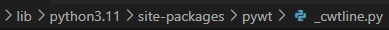
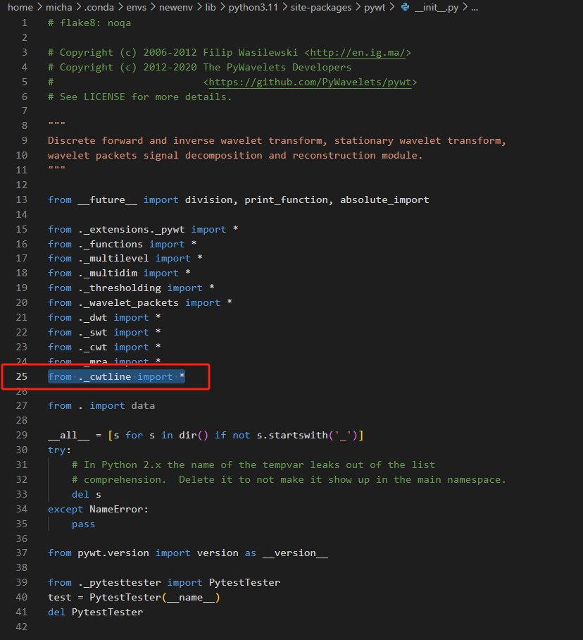

# TimeWaves
The code of TimeWaves model for dynamical forecasting

## Download datasets
The data used in this project can be found at the link below,

Please download them and drag those 7 folders into ./dataset/.

https://drive.google.com/drive/folders/1xZso6MUk00Ly_o0gs3VVCF2Odr7sR6KY?usp=drive_link

## Preparation
TimeWaves model requires a custoum "_cwtline.py" to function.

'_cwtline.py' file can be found in the same folder as this README.txt.

To achieve this function, please proceed with the following steps:

1. Install Python 3.9. For convenience, execute the following command:
pip install -r requirements.txt

2. Modify the PyWavelets(pywt) pack:
- First, drag '_cwtline.py' into the "pywt" pack folder.
  

- Then, add a line of code (from ._cwtline import *) in line 25 of '__init__.py'.
  

3. Check function
- Go to the models folder and find 'TimesWave_boost.py'
- Locate line 41, and the code should recognize 'pywt.cwtline'.
- You are good to go！

## Run the program
Now we are ready to train and evaluate our model:
- We provide the experiment scripts for tested benchmarks shown in our paper under the folder ./scripts/.
- You can run the experiment results as the following examples（eg. long-term forecast - rocket）:
  
bash ./scripts/long_term_forecast/Rocket_script/TimeWaves.sh
